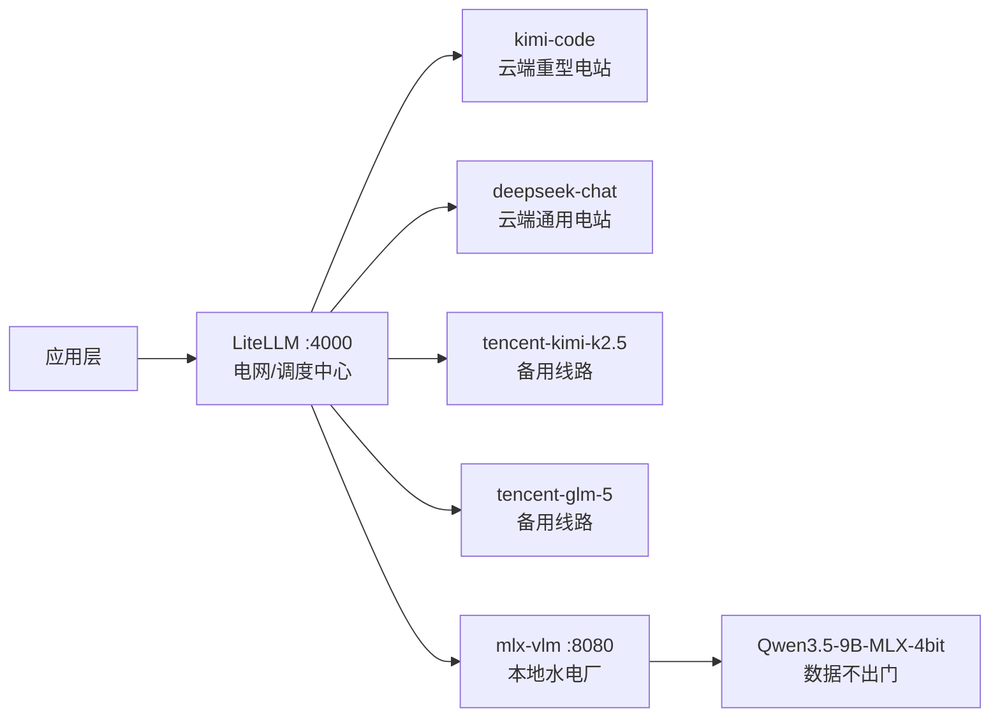

# 构建 AI 基础水电

用 LiteLLM + 本地模型，搭建属于自己的 AI 能源基础设施

<div class="pt-12 op-60">
  MacBook Pro M3 Pro · 36GB · LiteLLM · Ollama · mlx-vlm
</div>

---
layout: center
---

# 一个比喻

<div class="text-2xl leading-loose text-center">

用电的人不需要关心电从哪里来

<v-click>

电网屏蔽了水电、火电、核电的差异

只暴露一个统一的接口：**插座**

</v-click>

<v-click>

**AI 也可以有同样的基础设施**

</v-click>

</div>

---

# AI 的"水电基础设施"

<div class="grid grid-cols-3 gap-6 mt-8">

<div class="border border-white/20 rounded-lg p-4 text-center">
<div class="text-3xl mb-2">☁️</div>
<div class="font-bold mb-2">云端电网</div>
<div class="text-sm op-60">
购买外部电力<br/>
kimi / deepseek / minimax<br/>
按量付费，能力强
</div>
</div>

<div class="border border-blue-400 rounded-lg p-4 text-center">
<div class="text-3xl mb-2">🔌</div>
<div class="font-bold mb-2 text-blue-400">LiteLLM 电网</div>
<div class="text-sm op-60">
统一调度层<br/>
屏蔽差异，统一 API<br/>
负载均衡、监控、鉴权
</div>
</div>

<div class="border border-white/20 rounded-lg p-4 text-center">
<div class="text-3xl mb-2">🏭</div>
<div class="font-bold mb-2">本地水电厂</div>
<div class="text-sm op-60">
自建发电<br/>
Ollama / mlx-vlm<br/>
数据不出本地，稳定可控
</div>
</div>

</div>

<div class="mt-8 text-center op-70">

应用只需要调用 LiteLLM，**不关心电从哪来**

</div>

---

# LiteLLM：AI 电网的调度中心

**核心价值**：把手中掌握的一切 API 资源，用统一方式对外提供服务

```yaml {all|3-7|9-13|15-18}
# config.yaml —— 电网的配线图
model_list:
  - model_name: deepseek-chat          # 对外暴露的"插座名"
    litellm_params:
      model: deepseek/deepseek-chat    # 实际接的"电源"
      api_key: sk-xxx
      api_base: https://api.deepseek.com/v1

  - model_name: kimi-code
    litellm_params:
      model: anthropic/kimi-coding/k2p5
      api_key: sk-kimi-xxx
      api_base: https://api.kimi.com/coding/

  - model_name: tencent-kimi-k2.5     # 同一模型，不同渠道
    litellm_params:
      model: openai/kimi-k2.5
      api_key: sk-tencent-xxx
      api_base: https://api.lkeap.cloud.tencent.com/v3
```

---

# 当前接入的"电源"

<div class="grid grid-cols-2 gap-8">
<div>

**直连渠道**

| 模型 | 来源 |
|------|------|
| deepseek-chat | DeepSeek 官方 |
| deepseek-reasoner | DeepSeek 官方 |
| kimi-code | Kimi 官方 |

</div>
<div>

**腾讯云渠道**（备用/容灾）

| 模型 | 说明 |
|------|------|
| tencent-deepseek-v3.2 | DeepSeek V3.2 |
| tencent-kimi-k2.5 | Kimi K2.5 |
| tencent-glm-5 | GLM-5 |
| tencent-minimax-m2.5 | MiniMax M2.5 |

</div>
</div>

<div class="mt-6 p-4 bg-blue-900/40 border border-blue-400/30 rounded-lg">

💡 **关键洞察**：同一个模型可以接多个渠道。当一个渠道故障或限速时，LiteLLM 可以自动切换，就像电网的备用线路。

</div>

---

# LiteLLM 部署

运行在 Podman 容器中，持久后台服务：

```bash
podman ps
# CONTAINER ID  IMAGE                   STATUS   PORTS
# 99e1d39f48e6  ghcr.io/berriai/litellm Up       0.0.0.0:4000->4000/tcp
```

**统一调用方式**，无论背后接的是哪个模型：

```bash {1-6|7-8}
curl http://localhost:4000/v1/chat/completions \
  -H "Authorization: Bearer sk-litellm-master" \
  -H "Content-Type: application/json" \
  -d '{
    "model": "kimi-code",
    "messages": [{"role": "user", "content": "你好"}],
    "stream": true
  }'
```

<div class="mt-4 op-60 text-sm">

应用层只需知道 `http://localhost:4000` 和模型名，**底层随时可以换**

</div>

---
layout: fact
---

# ~22 t/s

kimi-code · 非流式均速 · 首 token < 1s · 128k+ 上下文

---

# 云端电网测速：kimi-code

<div class="grid grid-cols-2 gap-8">
<div>

**实测数据**

| 测试方式 | 速度 |
|---------|------|
| 非流式 | ~22.8 tokens/s |
| 流式首 token | < 1s |
| 流式总耗时（3491 tokens） | ~12s |

</div>
<div>

**kimi-code 能力**

- 参数：千亿级 MoE（激活 ~32B+）
- 上下文：128k+
- 专为代码优化
- 复杂架构设计可靠

</div>
</div>

<div class="mt-6">

```python
# 流式输出，体感流畅
{"model": "kimi-code", "stream": true}
# → 首 token 极快，内容实时输出
```

</div>

---
layout: center
---

# 现在，加一座自己的水电厂

<div class="text-xl op-70 mt-4">

本地模型 = 自建发电

数据不出本地，零成本，稳定可控

</div>

---
layout: two-cols
---

# 本地水电厂：选型

**环境**：MacBook Pro M3 Pro 36GB
- 统一内存带宽 ~150 GB/s
- M3 不支持 Metal Tensor API

**运行模型：Qwen3.5-9B**

| 项目 | 参数 |
|------|------|
| 参数量 | 9.7B |
| 量化 | Q4_K_M（GGUF）/ 4bit（MLX） |
| 文件大小 | 6.1 GB / ~5 GB |
| 上下文 | 32k |
| 特点 | 支持思考模式（`enable_thinking`） |

**实测速度对比**

| | Ollama | mlx-vlm |
|---|---|---|
| 推理引擎 | llama.cpp + Metal | MLX |
| 生成速度 | 15.62 t/s | **24.81 t/s** |
| 多模态 | 有限 | ✅ 原生 |

::right::

<div class="pl-8">

**为什么 MLX 快 59%？**

<div class="text-sm mt-2 op-80">

M3 不支持 Metal Tensor API

→ llama.cpp 受限，只能跑 **15 t/s**

MLX 是 Apple 专为 Apple Silicon 设计的框架，有独立计算内核，不依赖 Metal Tensor API

→ 跑到 **24 t/s**，提升 59%

</div>

<div class="mt-4 p-3 bg-blue-900/40 border border-blue-400/30 rounded-lg text-sm">

**结论**：M3 上首选 MLX 后端

</div>

</div>

---
layout: fact
---

# +59%

MLX vs Ollama · 24.81 t/s vs 15.62 t/s · M3 Pro 36GB

---

# 搭建本地水电厂：mlx-vlm

```bash
# 独立环境，避免依赖冲突
conda create -n mlx-vlm python=3.11 -y
pip install mlx-vlm torch torchvision

# 启动，直接复用 LM Studio 已下载的模型
python -m mlx_vlm.server --port 8080
```

**调用方式与 LiteLLM 完全兼容**：

```json
{
  "model": "~/.lmstudio/models/mlx-community/Qwen3.5-9B-MLX-4bit",
  "messages": [{"role": "user", "content": "你好"}],
  "enable_thinking": false,
  "stream": true
}
```

<div class="mt-4 p-3 bg-green-900/40 border border-green-400/30 rounded-lg text-sm">

✅ 生成速度 ~24 t/s · 峰值内存 ~6GB · 原生多模态 · 数据不出本地

</div>

---

# 踩坑：LM Studio 多模态

尝试用 LM Studio 处理图片时遇到两个坑：

<v-clicks>

**坑一：Context Overflow 策略不支持图片**
```
TruncateMiddle context overflow policy is not currently
supported for prompts with images.
```

**坑二：Context Length 100000 → Metal 内存超限崩溃**
```
Attempting to allocate 24454103552 bytes >
maximum allowed buffer size of 22613000192 bytes
```
KV Cache ≈ 14GB + 模型权重 6GB = 超出 Metal 22.6GB 上限

**解决：mlx-vlm 原生支持多模态，无上述问题** ✅

</v-clicks>

---
layout: two-cols
---

# <span class="whitespace-nowrap">水电厂的实际应用：视频理解</span>

<div class="text-sm op-70 mb-3">

VLM 本身不能直接"看视频"，采用**抽帧**方式间接理解：
每隔 5s 截取一帧图片 → VLM 逐帧分析 → 汇总成完整叙事

</div>

```python
frames  = extract_frames(video, interval=5)  # 133s 视频 → 27 帧
descs   = [analyze_frame(f) for f in frames] # 每帧送入 mlx-vlm
summary = summarize(descs)                   # 按时间线汇总
```

<div class="text-xs op-50 mt-1">27 帧逐帧分析 · 总耗时约 1~2 分钟</div>

<video
  src="/pizza_party.mp4"
  controls
  class="mt-4 rounded-lg"
  style="width: 75%; aspect-ratio: 4/3; object-fit: contain;"
/>

::right::

<div class="pl-6" style="font-size: 0.5rem; line-height: 1.5; margin-top: 3rem;">

**27 帧分析结果**：

<div style="display:grid; grid-template-columns: 2.5rem 1fr; gap: 0 0.4rem;">
<span class="op-50">0s</span><span>黑色背景标题页，白字"Pizza Party / Example Video!"</span>
<span class="op-50">5s</span><span>男子坐在电脑前，全神贯注看屏幕</span>
<span class="op-50">10s</span><span>屏幕特写，绿色终端命令正在执行</span>
<span class="op-50">15s</span><span>终端输入 ./pizza_party -help</span>
<span class="op-50">20s</span><span>绿色 CLI 文本，pizza_party 使用说明</span>
<span class="op-50">25s</span><span>帮助文档，展示 party/size/orders 参数</span>
<span class="op-50">30s</span><span>pizza_party 命令示例与参数列表</span>
<span class="op-50">35s</span><span>--username、--password 等参数选项</span>
<span class="op-50">40s</span><span>带用户输入提示符的命令行文本</span>
<span class="op-50">45s</span><span>字母索引菜单，含 force/help/onions</span>
<span class="op-50">50s</span><span>食材列表：洋葱、青椒、蘑菇等</span>
<span class="op-50">55s</span><span>食材列表：橄榄、番茄、菠萝、奶酪、香肠</span>
<span class="op-50">60s</span><span>菜单：香肠、培根、鸡肉选项</span>
<span class="op-50">65s</span><span>pizza_party 脚本，含 ground beef/grilled chicken</span>
<span class="op-50">70s</span><span>详细披萨配料清单（培根、牛肉、烤鸡）</span>
<span class="op-50">75s</span><span>终端显示 movieZZZZ/accounts，正在输入命令</span>
<span class="op-50">80s</span><span>绿色等宽字体的多行菜单选项</span>
<span class="op-50">85s</span><span>订单确认：medium thin pizza with mushrooms，$12.48</span>
<span class="op-50">90s</span><span>用户 fruminator 成功下单中号薄底披萨</span>
<span class="op-50">95s</span><span>昏暗室内，屏幕发出绿色光</span>
<span class="op-50">100s</span><span>模拟在线订餐服务对话的终端界面</span>
<span class="op-50">105s</span><span>模糊室内，昏暗房间一角</span>
<span class="op-50">110s</span><span>穿迷彩上衣的男子背对镜头走上昏暗楼梯</span>
<span class="op-50">115s</span><span>穿红色上衣的人抱黑色物体靠墙，走廊昏暗</span>
<span class="op-50">120s</span><span>透明塑料膜包裹的物体，放在红黑图案白色纸盒内</span>
<span class="op-50">125s</span><span>昏暗灯光下，巨大深色长条状光滑物体</span>
<span class="op-50">130s</span><span>双手拿着老式相机，背景是桌上的纸张和遥控器</span>
</div>

</div>

---

# 云端 vs 本地：能力对比

速度相近，能力差距悬殊

| 维度 | 本地 qwen3.5:9b | 云端 kimi-code |
|------|----------------|---------------|
| 速度 | ~24 t/s | ~22 t/s |
| 参数量 | 9.7B | 千亿级 MoE |
| 上下文 | 8k~32k | 128k+ |
| 写简单代码 | ✅ | ✅ 更完整 |
| 理解大型代码库 | ❌ 容易丢上下文 | ✅ |
| 复杂架构设计 | ❌ 经常出错 | ✅ |
| 数据隐私 | ✅ 不出本地 | ❌ 上传云端 |
| 成本 | ✅ 零边际成本 | 按量计费 |

<div class="mt-4 text-center op-70">

速度是**量**，能力是**质**，隐私是**边界**

</div>

---
layout: two-cols
---

# 完整基础设施全景



::right::

<div class="pl-8">

**各层职责**

<v-clicks>

- **应用层**：只知道 `localhost:4000`，不关心后端

- **LiteLLM**：统一鉴权、路由、监控、负载均衡

- **云端模型**：复杂任务、大上下文、强推理

- **本地模型**：隐私数据、多模态、零成本、离线场景

</v-clicks>

<div class="mt-6 p-3 bg-blue-900/40 border border-blue-400/30 rounded-lg text-sm" v-click>

💡 未来可以把 mlx-vlm 也接入 LiteLLM，真正做到"统一插座"

</div>

</div>

---
layout: center
---

# 总结

<div class="grid grid-cols-3 gap-6 mt-8 text-center">

<div class="border border-white/20 rounded-lg p-4">
<div class="text-2xl mb-2">🔌</div>
<div class="font-bold">LiteLLM</div>
<div class="text-sm op-60 mt-2">
统一 API 入口<br/>
屏蔽多云差异<br/>
随时切换底层
</div>
</div>

<div class="border border-white/20 rounded-lg p-4">
<div class="text-2xl mb-2">🏭</div>
<div class="font-bold">本地 MLX</div>
<div class="text-sm op-60 mt-2">
M3 Pro 最快选择<br/>
比 Ollama 快 59%<br/>
多模态原生支持
</div>
</div>

<div class="border border-white/20 rounded-lg p-4">
<div class="text-2xl mb-2">⚡</div>
<div class="font-bold">混合策略</div>
<div class="text-sm op-60 mt-2">
隐私用本地<br/>
复杂任务用云端<br/>
成本与能力平衡
</div>
</div>

</div>

<div class="mt-10 op-60">

**https://github.com/leavingme/local-llm-notes**

</div>
